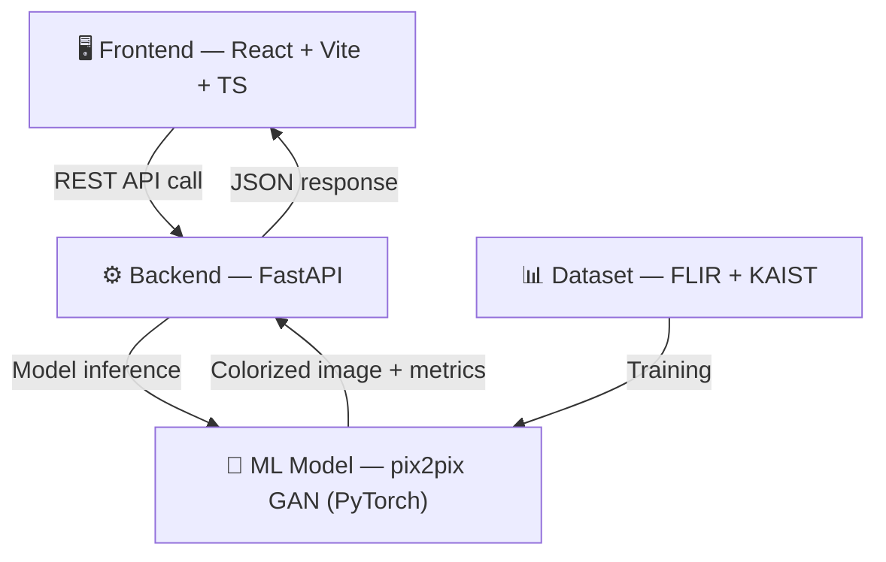

# SPECTRA — Full Implementation Plan
## PS 10: Infrared Image Colorization & Enhancement | BAH 2026

---

## 🎯 Goal

Build **SPECTRA** — an end-to-end system that takes raw grayscale/thermal infrared images and produces colorized, enhanced RGB images using a trained pix2pix GAN. The system includes a trained ML model, a FastAPI inference backend, and a stunning React frontend with a live before/after comparison slider.

---

## 📐 System Architecture



---

## User Review Required

> [!IMPORTANT]
> **Manual steps YOU must do** (I cannot do these for you):
> 1. **Download FLIR Thermal Dataset** from [Kaggle](https://www.kaggle.com/datasets/harrishs/flir-thermal-images-dataset) — needs Kaggle account
> 2. **Download KAIST Multispectral Dataset** from [their website](https://soonminhwang.github.io/rgbt-ped-detection/) — backup dataset
> 3. **Train the model on Google Colab** — I'll write the full training notebook, you run it on a free T4 GPU
> 4. **Download the trained `.pth` checkpoint** from Colab and place it in `backend/model/`
> 5. **Deploy**: Push frontend to Vercel, backend to Railway/Render (I'll provide configs)

> [!WARNING]
> **Deadline pressure**: Idea submission is July 1 (~19 days). I recommend:
> - Week 1: Have model trained + backend running locally
> - Week 2: Frontend complete + deployed demo
> - Week 3: Polish, edge cases, prepare presentation
> - Keep June 15–16 free for ISRO explainer sessions — they may reveal evaluation criteria

---

## Open Questions

> [!IMPORTANT]
> 1. **Do you want me to include a "batch processing" mode** (upload multiple images at once) or keep it single-image for the demo?
> 2. **Do you want ONNX export** for the model? This would enable browser-side inference (no backend needed) but adds complexity. Could be a massive WOW factor — "runs entirely in the browser."
> 3. **Do you want a sample gallery** with pre-processed examples on the landing page, or keep it purely upload-based?
> 4. **Presentation/pitch deck** — do you want me to generate a slide template for the idea submission too?

---

## Proposed Changes

### 📁 Final Project Structure

```
Spectra-ISRO/
├── frontend/                    # React + Vite + TypeScript
│   ├── src/
│   │   ├── components/
│   │   │   ├── UploadZone.tsx           # Drag & drop IR image upload
│   │   │   ├── BeforeAfterSlider.tsx    # Side-by-side comparison slider (hero)
│   │   │   ├── MetricsPanel.tsx         # PSNR/SSIM/processing time badges
│   │   │   ├── Navbar.tsx               # Top navigation
│   │   │   ├── Footer.tsx               # Footer with ISRO/BAH branding
│   │   │   ├── HeroSection.tsx          # Landing page hero
│   │   │   ├── HowItWorks.tsx           # Architecture explainer section
│   │   │   ├── SampleGallery.tsx        # Pre-processed sample showcase
│   │   │   └── LoadingOverlay.tsx       # Processing animation
│   │   ├── pages/
│   │   │   ├── LandingPage.tsx          # Home page
│   │   │   └── ProcessPage.tsx          # Upload + process + results
│   │   ├── hooks/
│   │   │   └── useColorize.ts           # API hook for /colorize
│   │   ├── utils/
│   │   │   └── api.ts                   # Axios/fetch wrapper
│   │   ├── assets/                      # Static images, logos
│   │   ├── App.tsx
│   │   ├── App.css
│   │   ├── index.css                    # Design system tokens
│   │   └── main.tsx
│   ├── public/
│   │   └── favicon.svg
│   ├── index.html
│   ├── package.json
│   ├── tsconfig.json
│   └── vite.config.ts
│
├── backend/                     # FastAPI + PyTorch
│   ├── app/
│   │   ├── main.py                      # FastAPI app + lifespan
│   │   ├── routes/
│   │   │   └── colorize.py              # POST /colorize endpoint
│   │   ├── services/
│   │   │   ├── inference.py             # Model loading + inference pipeline
│   │   │   └── metrics.py              # PSNR/SSIM computation
│   │   ├── models/
│   │   │   └── generator.py             # U-Net Generator architecture
│   │   └── utils/
│   │       ├── preprocessing.py         # Image resize/normalize
│   │       └── postprocessing.py        # Tensor → PIL → base64
│   ├── model/
│   │   └── .gitkeep                     # Placeholder for .pth checkpoint
│   ├── requirements.txt
│   ├── Dockerfile
│   └── .env.example
│
├── ml/                          # Training pipeline
│   ├── train.py                         # Full training script
│   ├── dataset.py                       # PyTorch Dataset class
│   ├── models/
│   │   ├── generator.py                 # U-Net Generator
│   │   └── discriminator.py             # PatchGAN Discriminator
│   ├── losses.py                        # Adversarial + L1 + SSIM losses
│   ├── evaluate.py                      # PSNR/SSIM evaluation script
│   ├── utils.py                         # Training utilities
│   ├── config.py                        # Hyperparameters
│   ├── notebooks/
│   │   └── SPECTRA_Training.ipynb       # Google Colab notebook (ready to run)
│   └── data/
│       └── .gitkeep                     # Placeholder for datasets
│
├── README.md                    # Project documentation
├── .gitignore
└── vercel.json                  # Frontend deployment config
```

---

### Component 1: ML Model (pix2pix GAN)

The core of SPECTRA. A conditional GAN that translates grayscale IR images → RGB colorized images.

#### [NEW] [generator.py](file:///c:/Users/piyus/Downloads/Spectra-ISRO/ml/models/generator.py)
**U-Net Generator** (256×256 input → 256×256 RGB output)

| Layer | Type | Channels | Output Size |
|-------|------|----------|-------------|
| Encoder 1 | Conv2d(s2) + LeakyReLU | 1 → 64 | 128×128 |
| Encoder 2 | Conv2d(s2) + BN + LeakyReLU | 64 → 128 | 64×64 |
| Encoder 3 | Conv2d(s2) + BN + LeakyReLU | 128 → 256 | 32×32 |
| Encoder 4 | Conv2d(s2) + BN + LeakyReLU | 256 → 512 | 16×16 |
| Encoder 5 | Conv2d(s2) + BN + LeakyReLU | 512 → 512 | 8×8 |
| Encoder 6 | Conv2d(s2) + BN + LeakyReLU | 512 → 512 | 4×4 |
| Encoder 7 | Conv2d(s2) + BN + LeakyReLU | 512 → 512 | 2×2 |
| Bottleneck | Conv2d(s2) + ReLU | 512 → 512 | 1×1 |
| Decoder 7 | ConvT(s2) + BN + Dropout(0.5) + ReLU | 512 → 512 | 2×2 |
| Decoder 6 | ConvT(s2) + BN + Dropout(0.5) + ReLU | 1024 → 512 | 4×4 |
| Decoder 5 | ConvT(s2) + BN + Dropout(0.5) + ReLU | 1024 → 512 | 8×8 |
| Decoder 4 | ConvT(s2) + BN + ReLU | 1024 → 512 | 16×16 |
| Decoder 3 | ConvT(s2) + BN + ReLU | 1024 → 256 | 32×32 |
| Decoder 2 | ConvT(s2) + BN + ReLU | 512 → 128 | 64×64 |
| Decoder 1 | ConvT(s2) + BN + ReLU | 256 → 64 | 128×128 |
| Output | ConvT(s2) + Tanh | 128 → 3 | 256×256 |

Skip connections: Encoder i → Decoder (8-i) via channel concatenation.

#### [NEW] [discriminator.py](file:///c:/Users/piyus/Downloads/Spectra-ISRO/ml/models/discriminator.py)
**PatchGAN Discriminator** (70×70 receptive field)
- Input: concatenated [IR image, RGB image] = 4 channels
- Outputs: 30×30 patch map (each pixel = real/fake probability for that patch)
- Architecture: 4 Conv2d blocks with increasing channels (64→128→256→512) + final 1-channel output

#### [NEW] [train.py](file:///c:/Users/piyus/Downloads/Spectra-ISRO/ml/train.py)
Training loop with:
- **Adversarial Loss**: BCEWithLogitsLoss (or MSE for LSGAN stability)
- **L1 Loss**: pixel-wise reconstruction, weighted λ=100
- **Adam optimizer**: lr=0.0002, β1=0.5, β2=0.999
- **Batch size**: 1 (as per original pix2pix paper)
- **Epochs**: 200 (with checkpoint saves every 20)
- Weight init: N(0, 0.02) for Conv layers

#### [NEW] [dataset.py](file:///c:/Users/piyus/Downloads/Spectra-ISRO/ml/dataset.py)
PyTorch Dataset class:
- Loads paired IR/RGB images from `data/train/A` and `data/train/B`
- Resize to 256×256
- Random horizontal flip (augmentation)
- Random jitter: resize to 286×286, random crop to 256×256
- Normalize to [-1, 1]
- IR images: convert to single-channel, then stack 3× for model compatibility

#### [NEW] [SPECTRA_Training.ipynb](file:///c:/Users/piyus/Downloads/Spectra-ISRO/ml/notebooks/SPECTRA_Training.ipynb)
Ready-to-run Colab notebook that:
1. Mounts Google Drive
2. Downloads/unzips dataset
3. Runs full training (200 epochs, ~4-6 hours on T4)
4. Saves best checkpoint to Drive
5. Generates sample outputs for visual inspection

---

### Component 2: Backend (FastAPI)

Serves the trained model for inference via REST API.

#### [NEW] [main.py](file:///c:/Users/piyus/Downloads/Spectra-ISRO/backend/app/main.py)
- FastAPI app with `lifespan` context manager
- Loads model once at startup into memory
- CORS middleware for frontend
- Health check at `GET /health`

#### [NEW] [colorize.py](file:///c:/Users/piyus/Downloads/Spectra-ISRO/backend/app/routes/colorize.py)
`POST /colorize` endpoint:
1. Accept multipart file upload (PNG/JPG)
2. Validate file type and size (max 10MB)
3. Preprocess: resize → normalize → tensor
4. Run inference with `torch.inference_mode()`
5. Postprocess: denormalize → PIL Image → base64
6. Compute PSNR and SSIM vs. input enhancement metrics
7. Return JSON:
```json
{
  "colorized_image": "data:image/png;base64,...",
  "metrics": {
    "psnr": 28.45,
    "ssim": 0.87,
    "processing_time_ms": 342
  },
  "original_size": [640, 480],
  "processed_size": [256, 256]
}
```

#### [NEW] [inference.py](file:///c:/Users/piyus/Downloads/Spectra-ISRO/backend/app/services/inference.py)
- Model loading from `.pth` checkpoint
- CPU/GPU device detection
- Preprocessing pipeline (PIL → tensor)
- Postprocessing pipeline (tensor → PIL → base64)

#### [NEW] [metrics.py](file:///c:/Users/piyus/Downloads/Spectra-ISRO/backend/app/services/metrics.py)
- PSNR computation using scikit-image
- SSIM computation using scikit-image
- Processing time measurement

---

### Component 3: Frontend (React + Vite + TypeScript)

The WOW factor. Dark, premium, ISRO-themed UI.

#### Design System

| Token | Value |
|-------|-------|
| `--bg-primary` | `#0a0a0f` (deep space black) |
| `--bg-secondary` | `#12121a` (card background) |
| `--bg-tertiary` | `#1a1a2e` (elevated surfaces) |
| `--accent-primary` | `#4f8ef7` (electric blue — ISRO vibe) |
| `--accent-secondary` | `#7c3aed` (deep purple) |
| `--accent-gradient` | `linear-gradient(135deg, #4f8ef7, #7c3aed)` |
| `--text-primary` | `#f0f0f5` |
| `--text-secondary` | `#8888a0` |
| `--success` | `#22c55e` |
| `--warning` | `#f59e0b` |
| `--border` | `rgba(255,255,255,0.06)` |
| `--glass` | `rgba(255,255,255,0.03)` |
| `--font-primary` | `'Inter', sans-serif` |
| `--font-display` | `'Space Grotesk', sans-serif` |
| `--radius` | `12px` |
| `--radius-lg` | `20px` |

#### Key Pages

**Landing Page** (`/`)
- Hero section: animated gradient background, SPECTRA logo, tagline "Transform Infrared Into Vision"
- "How It Works" — 3-step visual (Upload → Process → Download)
- Sample gallery showing before/after examples
- CTA button → "Try SPECTRA Now"
- Tech stack badges (PyTorch, FastAPI, React)
- Footer with BAH 2026 + ISRO branding

**Process Page** (`/process`)
- Upload zone: large drag & drop area with dashed border, pulse animation on hover
- After upload: thumbnail preview of IR image
- "Colorize" button triggers API call
- Loading state: skeleton shimmer + processing percentage animation
- **Result view (the hero)**:
  - **Before/After slider**: draggable divider, IR on left, colorized on right
  - Metrics panel below: PSNR badge (green), SSIM badge (blue), processing time (gray)
  - Download button (downloads PNG)
  - "Try Another" button

#### Key Components

##### [NEW] BeforeAfterSlider.tsx
The most important component. Custom-built comparison slider:
- Canvas-based or CSS clip-path approach
- Draggable divider line with thumb handle
- Labels "INFRARED" and "COLORIZED" on each side
- Smooth drag with touch support
- Glassmorphic divider line

##### [NEW] UploadZone.tsx
- Drag & drop with `onDragOver`/`onDrop` handlers
- Click to select file fallback
- File validation (PNG/JPG, max 10MB)
- Preview generation via `FileReader`
- Animated border on drag hover

##### [NEW] MetricsPanel.tsx
- Three metric cards with glassmorphism
- Animated count-up numbers
- Color-coded badges (PSNR → green, SSIM → blue, Time → purple)
- Tooltip explanations of each metric

##### [NEW] LoadingOverlay.tsx
- Full-screen overlay during processing
- Animated neural network visualization or pulse rings
- "Analyzing thermal patterns..." → "Reconstructing color channels..." → "Enhancing details..." rotating text

---

### Component 4: Configuration & Deployment

#### [NEW] .gitignore
Comprehensive ignore for Python, Node, model weights, datasets

#### [NEW] Dockerfile (backend)
Multi-stage build: Python 3.11-slim base, install deps, copy app + model, run with uvicorn

#### [NEW] vercel.json (frontend)
SPA routing config for Vercel deployment

#### [NEW] README.md
Full project documentation with architecture diagram, setup instructions, screenshots

---

## 📦 What YOU Need To Do Manually

### 1. Dataset Setup (~2 hours)

**Option A: FLIR Thermal Dataset (RECOMMENDED)**
1. Go to [Kaggle FLIR Dataset](https://www.kaggle.com/datasets/harrishs/flir-thermal-images-dataset)
2. Download the dataset (~4GB)
3. Extract to `ml/data/`
4. I'll provide a preprocessing script that:
   - Pairs IR and RGB images by filename
   - Resizes all to 256×256
   - Creates `train/A/` (IR) and `train/B/` (RGB) structure
   - Creates `val/A/` and `val/B/` (10% split)

**Option B: KAIST Multispectral (backup/supplement)**
1. Go to [KAIST RGBT Dataset](https://soonminhwang.github.io/rgbt-ped-detection/)
2. Download visible + thermal pairs
3. Same preprocessing applies

### 2. Training (~4-6 hours on Colab)

1. Upload the `ml/` folder to Google Drive
2. Open `SPECTRA_Training.ipynb` in Colab
3. Select GPU runtime (T4 is free)
4. Run all cells — training will take 4-6 hours for 200 epochs
5. Best checkpoint auto-saves to `model/generator_best.pth`
6. Download `generator_best.pth` → place in `backend/model/`

### 3. Deployment

**Frontend → Vercel (free)**
1. `cd frontend && npm run build`
2. Push to GitHub → connect to Vercel → auto-deploy

**Backend → Railway or Render (free tier)**
1. Push `backend/` to GitHub
2. Connect to Railway/Render
3. Set env: `MODEL_PATH=model/generator_best.pth`
4. Deploy (Dockerfile provided)

---

## Verification Plan

### Automated Tests
```bash
# ML model tests
cd ml && python -m pytest tests/ -v

# Backend tests
cd backend && python -m pytest tests/ -v

# Frontend lint + type check
cd frontend && npm run lint && npx tsc --noEmit
```

### Manual Verification
1. Upload a sample FLIR thermal image → verify colorized output looks natural
2. Check PSNR > 20 dB and SSIM > 0.6 on validation set
3. Verify before/after slider works on desktop + mobile
4. Test with non-IR images → verify graceful error handling
5. Test with very large images (>5MB) → verify resize pipeline
6. Verify < 2 second inference time on deployed backend

---

## 🏆 Judge Wow Factors (Built-In)

| Feature | Why It Wins |
|---------|-------------|
| **Live before/after slider** | Instant visual proof of value — most impressive demo element |
| **Real trained GAN** | Not a filter or lookup table — actual deep learning |
| **PSNR/SSIM metrics** | Scientific rigor — shows you understand image quality evaluation |
| **< 2s inference** | Real-time usability, not a research prototype |
| **ISRO-themed UI** | Shows you care about the context, not just the tech |
| **Full-stack deployment** | Working live demo > slides with screenshots |
| **Responsive design** | Works on judge's phone too |

---

## Execution Timeline

| Day | Task |
|-----|------|
| Day 1–2 | ML: Build generator, discriminator, training pipeline |
| Day 2 | ML: Preprocessing script, dataset loader |
| Day 3 | ML: Start training on Colab (runs overnight) |
| Day 4–5 | Backend: FastAPI endpoints, inference pipeline |
| Day 6–8 | Frontend: Design system, landing page, upload zone |
| Day 9–10 | Frontend: Before/after slider (hero component), metrics panel |
| Day 11–12 | Integration: Connect frontend → backend, end-to-end testing |
| Day 13–14 | Polish: Animations, loading states, error handling |
| Day 15 | Deploy: Vercel + Railway, verify live demo |
| Day 16–17 | Documentation: README, Colab notebook cleanup |
| Day 18–19 | Presentation prep, demo video recording |
