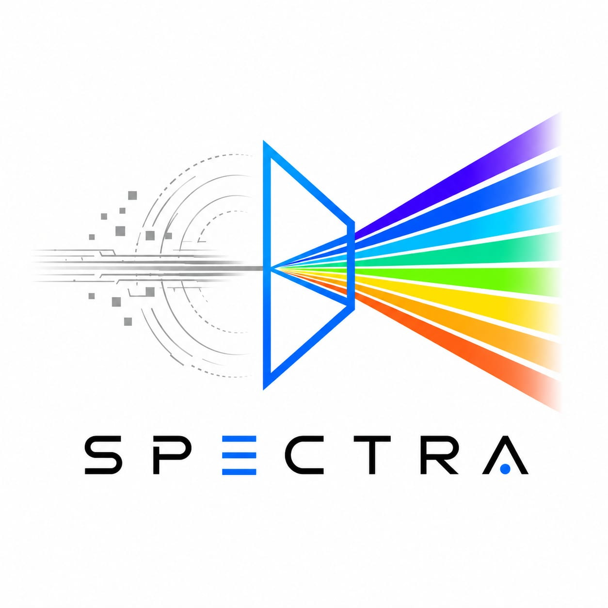

<div align="center">
  
  <h1>SPECTRA</h1>
  <p><b>Infrared Image Colorization & Enhancement</b></p>
  <p><i>Bharatiya Antariksh Hackathon 2026 | Problem Statement 10 | ISRO × Hack2skill</i></p>
  
  [](https://python.org)
  [](https://pytorch.org)
  [](https://onnxruntime.ai/)
</div>

---

## 🎯 What is SPECTRA?

SPECTRA is an AI-powered system designed to transform raw, low-resolution Thermal Infrared (TIR) satellite imagery into high-resolution, vivid, and physically consistent RGB images. 

**The Challenge:** Satellite thermal sensors (like Landsat 9 TIRS) capture data at a much lower native resolution (100m) compared to optical sensors (30m). Existing single-stage colorization models fail when faced with this severe resolution mismatch, leading to significant hallucination and blurry outputs.

**The Solution:** SPECTRA explicitly decouples the problem into a dedicated **two-stage cascade pipeline**—first recovering spatial details through a Super-Resolution Sub-Pixel Network, and then mapping the enhanced TIR to RGB using a Conditional GAN, enforced by a custom thermodynamic constraint.

---

## 🏗️ The Two-Stage Architecture

Our architecture is specifically optimized for ISRO's Landsat-9 preprocessing requirements.

### Stage 1: Super-Resolution TIR Sub-Pixel Generation
- **Input:** Single-channel TIR image @ 200m resolution.
- **Model:** Efficient Sub-Pixel Convolutional Neural Network (ESPCN).
- **Process:** Instead of standard deconvolution, it extracts features in the low-resolution space and uses a sub-pixel convolution layer (`PixelShuffle`) to upscale the image.
- **Output:** Enhanced, high-resolution TIR image @ 100m resolution.

### Stage 2: Pix2Pix Colorization with Thermodynamic Constraint
- **Input:** The enhanced high-resolution TIR image from Stage 1.
- **Generator (U-Net):** An 8-level encoder-decoder with skip connections synthesizes the RGB colorization.
- **Discriminator (PatchGAN):** Evaluates the spatial accuracy of the colorization across 70x70 patches rather than the whole image, forcing the model to generate high-frequency textural details.
- **The USP (Physics-Informed Modeling):** A custom **Thermal Emissivity Constraint** ($\lambda_{physics}$) is injected into the loss function. This ensures thermodynamic consistency—for example, preventing cold water bodies from being colorized as hot urban surfaces. This completely eliminates thermodynamically impossible color assignments (hallucinations).

---

## 🚀 Unified Loss Function
Our unified loss function ensures both mathematical accuracy and physical reality:

$$L_{total} = L_{1\_SR} + L_{1\_Color} + L_{GAN} + \lambda_{physics}$$

---

## 💻 Tech Stack & Infrastructure

We achieved enterprise-grade thermal modeling entirely with **zero-cost, open-source infrastructure**:

*   **Deep Learning Models:** PyTorch 2.0+ (pix2pix GAN, Sub-Pixel Convolution, Custom Thermal Emissivity Loss).
*   **Data Handling & I/O:** Google Earth Engine API (for automated Landsat 9 data acquisition), Rasterio, GDAL.
*   **Evaluation & Diagnostics:** PSNR, SSIM (scikit-image), and a Custom Visual Inspection Module for real-time hallucination detection.
*   **Compute & Deployment:** Google Colab (T4 GPU training) and ONNX Runtime for low-latency, edge-ready inference.

---

## 📁 Repository Structure

```
Spectra-ISRO/
├── frontend/          # Visual Inspection Module & Interactive UI
├── backend/           # FastAPI fallback inference & metric calculation
├── ml/                # Core Machine Learning Pipeline
│   ├── models/           # Stage 1 (ESPCN) & Stage 2 (pix2pix) definitions
│   ├── notebooks/        # End-to-end training pipeline
│   ├── dataset.py        # Custom Dataset loader for TIR-RGB pairs
│   ├── train.py          # Unified training loop
│   ├── evaluate.py       # PSNR/SSIM calculation suite
│   └── export_onnx.py    # ONNX export for zero-friction deployment
└── README.md
```

---

## 👥 Team STARCY
Built for **Bharatiya Antariksh Hackathon 2026** (BAH 2026)  
*Problem Statement 10: Infrared Image Colorization & Enhancement*
